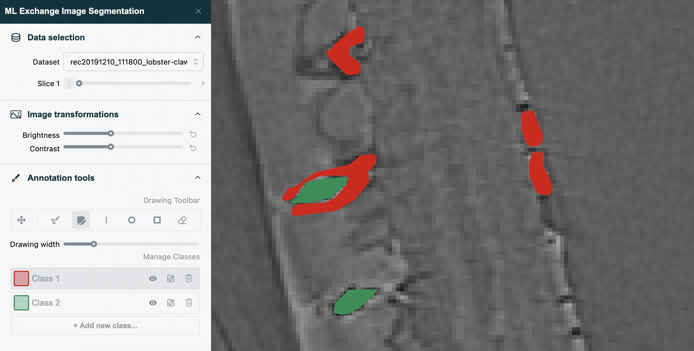

# Dash App for Segmentation of High-Resolution Images [](https://github.com/psf/black) [](https://pycqa.github.io/isort/)


This application is built using Plotly's [Dash](https://dash.plotly.com/) framework and provides a web-based interface for visualizing and annotating high resolution images output from [ALS](https://als.lbl.gov/) beamlines.

Image data is accessed via a [Tiled](https://github.com/bluesky/tiled) client, which provides chunkwise access to multidimensional TIFF sequences.



## How to use?

### Local development setup

1. Create a new Python virtual environment and install the project dependencies:

```
pip install -r requirements.txt
```

and

```
pip install -r requirements-dev.txt
```

2. Set environment variables via a `.env` file to configure a connection to the Tiled server, differentiate between local testing and development mode and set a user and password for basic autherization:

```
DATA_TILED_URI='https://tiled-seg.als.lbl.gov'
DATA_TILED_API_KEY=<key-provided-on-request>
DASH_DEPLOYMENT_LOC='Local'
MODE='dev'
```

3. Start a local server:

```
python app.py
```

### Algorithm registry in MLflow

First make sure the following environment variables are set in your `.env` file:
```
MLFLOW_TRACKING_USERNAME=<your_username>
MLFLOW_TRACKING_PASSWORD=<your_password>

MLFLOW_TRACKING_URI_OUTSIDE=<your_mlflow_uri>
ALGORITHM_JSON_PATH="../assets/models.json"
```
Inside the Python virtual environment you created, run the following commands:
```
cd scripts
python save_mlflow_algorithm.py
```


### Local tiled connection

For local testing of just the annotation functionality, developers may also choose to set up a local Tiled server with access to minimal datasets (eg. in the case that the remote server is down).

To download some sample data and serve it with a local Tiled serve
1. Additionally install the Tiled server components with `pip install "tiled[server]==0.2.0"`.
2. Set the input Tiled URI to localhost, e.g. set `DATA_TILED_URI`, to `http://localhost:8000/` within the `.env` file (or within your environmental variables), and use the result of a key generator (e.g. with `python3 -c "import secrets; print(secrets.token_hex(32))"`) for the key entry `DATA_TILED_API_KEY`
2. Run the script `python3 utils/download_sample_data.py`. This will create a `data/` directory and download 2 sample projects with 2 images each.
3. Run `/tiled_serve_dir.sh`.

Starting the app will now connect to the local tiled server instead.

### Deployment elsewhere

For deployment elsewhere add a user name and password to the environment file and remove `DASH_DEPLOYMENT_LOC = "Local"`. This protect access to the application with basic authentication:

```
USER_NAME=<to-be-specified-per-deployment>
USER_PASSWORD=<to-be-specified-per-deployment>
```

# Copyright
MLExchange Copyright (c) 2023, The Regents of the University of California, through Lawrence Berkeley National Laboratory (subject to receipt of any required approvals from the U.S. Dept. of Energy). All rights reserved.

If you have questions about your rights to use or distribute this software, please contact Berkeley Lab's Intellectual Property Office at IPO@lbl.gov.

NOTICE.  This Software was developed under funding from the U.S. Department of Energy and the U.S. Government consequently retains certain rights.  As such, the U.S. Government has been granted for itself and others acting on its behalf a paid-up, nonexclusive, irrevocable, worldwide license in the Software to reproduce, distribute copies to the public, prepare derivative works, and perform publicly and display publicly, and to permit others to do so.
